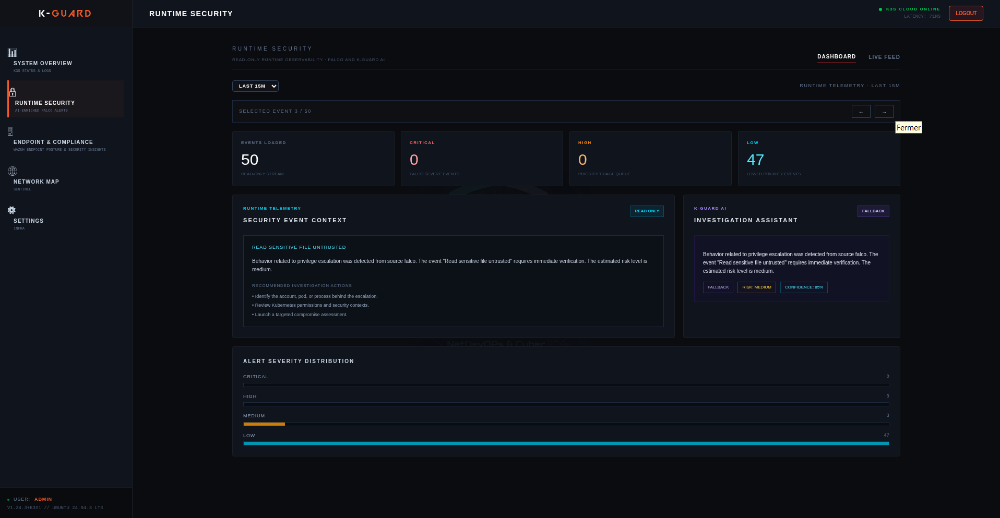
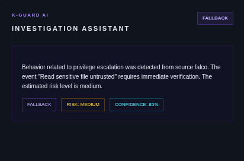
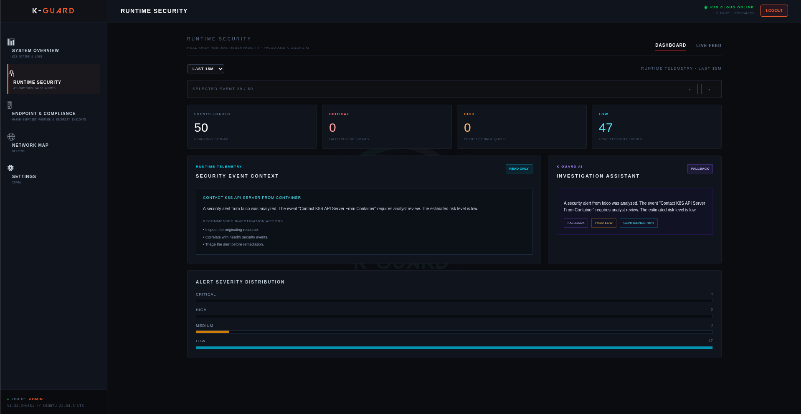
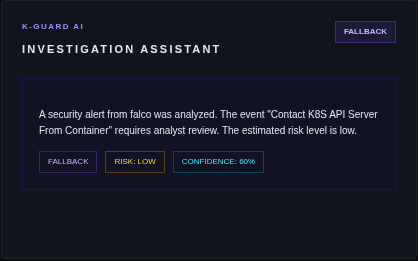

# 🤖 K-Guard AI

**Current release:** `v0.8.0` — Cloud-Native Security Enrichment Microservice & Local LLMOps Engine

> An asynchronous threat triage and security-enrichment microservice engineered with Java 21 and Spring Boot 3.5, leveraging local LLMs (Ollama) to normalize, contextualize, and score Falco runtime events for Kubernetes / K3s.

[](CHANGELOG.md)
[](https://openjdk.org)
[](https://spring.io/projects/spring-boot)
[](installer/)
[](https://ollama.com)
[](https://k3s.io)
[](https://ghcr.io)
[](LICENSE)

---

### 🔗 Quick Links

- 🚀 **Live Demo:** [https://app.devopsnotes.org](https://app.devopsnotes.org)
- 🛡️ **K-Guard Main Platform:** [github.com/KamouloxPelvis/k-guard](https://github.com/KamouloxPelvis/k-guard)
- 🌐 **Author Portfolio:** [https://devopsnotes.org](https://devopsnotes.org)
- 📖 **Technical Blog:** [https://blog.devopsnotes.org](https://blog.devopsnotes.org)

---

## 🌟 Core Capabilities

| Feature | Description |
|---|---|
| **⚡ Automated Threat Triage** | Normalizes complex Falco kernel/eBPF events into concise, actionable natural-language assessments. |
| **🧠 Zero Data Exfiltration (Local LLM)** | Integrates directly with local **Ollama** models (Mistral / Llama) ensuring all security telemetry stays on-premise. |
| **🎯 Dynamic Risk & Confidence Scoring** | Generates contextual severity ratings (*Low, Medium, High, Critical*) along with an inference confidence index. |
| **📦 Hardened Cloud-Native Deployment** | Runs in production on K3s with unprivileged user, read-only root filesystem, dropped Linux capabilities, and `RuntimeDefault` seccomp profile. |
| **🛠️ Interactive Go Installer (TUI & CLI)** | Ships with a dedicated Go-based setup utility providing both an interactive Terminal UI and scriptable CLI options. |
| **📊 Optional Elasticsearch Export** | Can stream enriched security alerts to downstream SIEM / Elasticsearch clusters for long-term indexing. |

---

## 📸 In Action: K-Guard AI Investigation Assistant

### 1. Privilege Escalation Analysis (`Risk: Medium` · `Confidence: 85%`)
The assistant detects suspicious container activity (*"Read sensitive file untrusted"*), synthesizes the potential escalation vector, and recommends immediate analyst verification.




---

### 2. Kubernetes API Server Access Triage (`Risk: Low` · `Confidence: 60%`)
Anomalous in-cluster API server calls are automatically correlated and triaged with an estimated severity level.




---

## 🏗️ Architecture & Pipeline

K-Guard AI operates as an independent backend service within the security ecosystem:

```text
  ┌─────────────────┐
  │  Falco (eBPF)   │
  └────────┬────────┘
           │ JSON Alert Stream
           ▼
  ┌─────────────────┐
  │   Fluent Bit    │
  └────────┬────────┘
           │ HTTP POST (Port 8080)
           ▼
  ┌─────────────────────────────────────────┐
  │             K-Guard AI                  │
  │    (Java 21 / Spring Boot 3.5)          │
  │                                         │
  │  ┌──────────────┐    ┌───────────────┐  │
  │  │ REST Intake  │───►│ LLM Connector │──┼───► Local Ollama Engine
  │  └──────────────┘    └───────┬───────┘  │      (Mistral / Llama)
  │                              │          │
  │                      Enriched Verdict   │
  └──────────────────────────────┬──────────┘
                                 │
                 ┌───────────────┴───────────────┐
                 ▼                               ▼
      ┌─────────────────────┐         ┌─────────────────────┐
      │   K-Guard Console   │         │ Elasticsearch SIEM  │
      │  (SOC Investigation)│         │     (Optional)      │
      └─────────────────────┘         └─────────────────────┘
```

---

## 🚀 Installation & Deployment

### 1. Local Build (Maven)

```bash
# Clone the repository
git clone https://github.com/KamouloxPelvis/K-Guard-AI.git
cd K-Guard-AI

# Run tests and build production JAR
mvn clean test
mvn clean package
```
*The packaged artifact is output to `target/k-guard-ai-0.8.0.jar`.*

---

### 2. Automated Installation via Go Installer (TUI / CLI)

The project includes an installer written in **Go 1.22+**:

```bash
# Build the Go installer
go -C installer build -o ./installer/kguard-ai-installer .

# 1. Interactive Terminal UI (TUI)
./installer/kguard-ai-installer

# 2. Automated CLI Mode (CI/CD)
./installer/kguard-ai-installer check
./installer/kguard-ai-installer install --namespace k-guard
./installer/kguard-ai-installer status
```

---

### 3. Kubernetes / K3s Native Manifests

All declarative manifests are located in [`k8s/`](k8s/):

```bash
# Apply ConfigMap, Deployment and Service
kubectl apply -f k8s/configmap.yaml -n k-guard
kubectl apply -f k8s/deployment.yaml -n k-guard
kubectl apply -f k8s/service.yaml -n k-guard

# Verify rollout status
kubectl rollout status deployment/kguard-ai -n k-guard
```

---

### 4. Standalone Host Deployment (Systemd + Nginx)

For hybrid or off-cluster environments:
1. Copy the JAR to `/opt/kguard-ai/app.jar`.
2. Configure a `systemd` service (`/etc/systemd/system/kguard-ai.service`) running Java 21.
3. Place Nginx in front as an HTTPS reverse-proxy terminating TLS.

---

## 🔒 Security & Hardening Model

- **Non-Root Execution:** The container runs under an unprivileged UID (`runAsNonRoot: true`).
- **Immutable Filesystem:** Read-only root filesystem with ephemeral memory storage for `/tmp`.
- **Capability Dropping:** All Linux kernel capabilities are explicitly dropped (`drop: ["ALL"]`).
- **Seccomp Protection:** Enforces `RuntimeDefault` seccomp profile to restrict unauthorized system calls.
- **Actuator Healthchecks:** Exposes dedicated `/actuator/health`, `/actuator/info` and Prometheus telemetry endpoints.

---

## 📄 License

K-Guard AI is open-source software licensed under the **[Apache License, Version 2.0](LICENSE)**.

---

## 👤 Author & Contact

**Kamal Guidadou** — *Administrateur Systèmes & Réseaux · Spécialiste DevSecOps & Cloud*

- 🌐 **Portfolio:** [https://devopsnotes.org](https://devopsnotes.org)
- 📝 **Blog:** [https://blog.devopsnotes.org](https://blog.devopsnotes.org)
- 💼 **LinkedIn:** [linkedin.com/in/kamal-guidadou](https://www.linkedin.com/in/kamal-guidadou)
- 🐙 **GitHub:** [@KamouloxPelvis](https://github.com/KamouloxPelvis)
